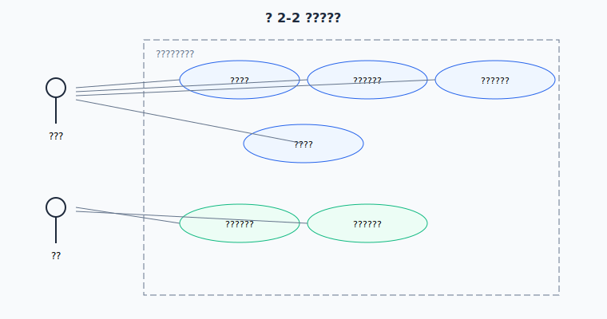

# 软件开发生产实习报告

---

**学院：** 南宁理工学院  
**实习名称：** 软件开发生产实习  
**题目：** 基于 Web 的学生成绩管理系统  
**专业班级：** ____________  
**姓名：** ____________  
**学号：** ____________  
**完成日期：** 2026 年 7 月

---

## 目录

1. [需求分析](#1-需求分析)
2. [模型设计](#2-模型设计)
3. [详细设计与实现](#3-详细设计与实现)
4. [编程源代码](#4-编程源代码)
5. [软件测试](#5-软件测试)
6. [总结](#6-总结)
7. [参考文献](#7-参考文献)

---

## 1 需求分析

### 1.1 项目背景

在学校教学管理中，学生成绩信息需要统一录入、查询和统计。传统纸质或 Excel 管理方式效率低、易出错。本系统面向两类用户：**管理员**负责维护学生、课程与成绩数据；**学生**登录后只能查看自己的成绩与个人信息，实现角色分离的信息化管理。

### 1.2 功能需求

| 编号 | 角色 | 功能 | 说明 |
|------|------|------|------|
| F01 | 全部 | 用户登录 | 管理员/学生分角色登录 |
| F02 | 管理员 | 管理员注册 | 注册新的管理员账号 |
| F03 | 管理员 | 学生管理 | 学生信息增删改查 |
| F04 | 管理员 | 课程管理 | 课程信息增删改查 |
| F05 | 管理员 | 成绩管理 | 成绩录入、删除、搜索 |
| F06 | 管理员 | 成绩统计 | 各科平均分、及格率图表 |
| F07 | 学生 | 个人信息 | 查看学号、姓名、班级 |
| F08 | 学生 | 我的成绩 | 仅查看本人各科成绩 |

### 1.3 非功能需求

- 界面简洁，管理员与学生界面分离
- 前后端使用 Ajax（fetch）异步通信
- 后端 Session 鉴权 + 角色权限控制
- 数据持久化存储在 SQLite
- 代码分层清晰，低耦合

### 1.4 可行性分析

**技术可行性：** Flask + SQLite + HTML/JavaScript 均为成熟技术，本地即可运行。

**经济可行性：** 全部免费开源，无部署成本。

**操作可行性：** 管理员使用表格表单管理数据；学生仅需查看成绩，操作简单。

---

## 2 模型设计

### 2.1 系统架构


浏览器通过 Ajax 请求 Flask 后端，后端调用 `db.py` 读写 SQLite。登录后服务端 Session 保存用户角色，接口按 `admin` / `student` 分别鉴权。

### 2.2 用例图



系统有两类参与者：**管理员**负责学生/课程/成绩管理与统计；**学生**负责登录、查看个人信息与本人成绩。

### 2.3 ER 图


用户表与学生表通过 `student_id` 关联：学生账号绑定一条学生档案，成绩表关联学生与课程。

### 2.4 数据表结构

**表 2-1 users（用户表）**

| 字段 | 类型 | 说明 |
|------|------|------|
| id | INTEGER | 主键 |
| username | TEXT | 用户名（学生账号为学号） |
| password | TEXT | 密码 |
| role | TEXT | admin / student |
| student_id | INTEGER | 外键，学生角色关联 students.id |

**表 2-2 students（学生档案表）**

| 字段 | 类型 | 说明 |
|------|------|------|
| id | INTEGER | 主键 |
| student_no | TEXT | 学号 |
| name | TEXT | 姓名 |
| class_name | TEXT | 班级 |
| gender | TEXT | 性别 |

**表 2-3 courses（课程表）**

| 字段 | 类型 | 说明 |
|------|------|------|
| id | INTEGER | 主键 |
| course_no | TEXT | 课程编号 |
| course_name | TEXT | 课程名称 |
| credit | INTEGER | 学分 |

**表 2-4 grades（成绩表）**

| 字段 | 类型 | 说明 |
|------|------|------|
| id | INTEGER | 主键 |
| student_id | INTEGER | 外键 |
| course_id | INTEGER | 外键 |
| score | REAL | 分数 |
| exam_term | TEXT | 学期 |

---

## 3 详细设计与实现

### 3.1 项目目录

```
student-grade-system/
├── app.py              # Flask 路由与权限
├── db.py               # 数据库操作
├── schema.sql          # 建表与测试数据
├── static/js/api.js    # Ajax 封装
├── templates/          # HTML 页面
│   ├── login.html
│   ├── index.html          # 管理员首页
│   ├── students.html
│   ├── grades.html
│   ├── stats.html
│   ├── student-home.html   # 学生首页
│   └── my-grades.html      # 学生成绩页
└── docs/实习报告.md
```

### 3.2 接口设计

| 方法 | 路径 | 权限 | 功能 |
|------|------|------|------|
| POST | /api/login | 公开 | 登录 |
| POST | /api/logout | 登录 | 退出 |
| GET | /api/me | 登录 | 当前用户与档案 |
| GET | /api/my/grades | 学生 | 本人成绩 |
| GET/POST/... | /api/students | 管理员 | 学生 CRUD |
| GET/POST/... | /api/grades | 管理员 | 成绩 CRUD |
| GET | /api/stats/* | 管理员 | 统计数据 |

### 3.3 界面展示

#### 3.3.1 登录页


**图 3-1 系统登录界面**（不显示测试账号，账号见 README）

#### 3.3.2 管理员首页


**图 3-2 管理员功能首页**

#### 3.3.3 学生管理页


**图 3-3 学生与课程管理界面**

#### 3.3.4 成绩管理页


**图 3-4 成绩录入与列表界面**

#### 3.3.5 搜索功能


**图 3-5 成绩搜索筛选结果**

#### 3.3.6 统计图表


**图 3-6 成绩统计图表界面**

#### 3.3.7 学生首页


**图 3-7 学生个人首页（个人信息）**

#### 3.3.8 我的成绩


**图 3-8 学生查看本人成绩界面**

### 3.4 关键流程

1. 用户登录，`app.py` 校验账号并写入 Session（含 role、student_id）
2. 前端根据 role 跳转：管理员 → `index.html`，学生 → `student-home.html`
3. 学生访问 `/api/my/grades`，后端 `@require_student` 校验后仅返回本人成绩
4. 学生访问 `/api/students` 等管理接口返回 403
5. 管理员通过 Ajax 完成 CRUD 与统计查询

---

## 4 编程源代码

### 4.1 登录与角色返回（db.py / app.py 节选）

```python
def login_user(username, password):
  row = conn.execute(
    "SELECT id, username, role, student_id FROM users WHERE username=? AND password=?",
    (username, password),
  ).fetchone()

@app.route("/api/login", methods=["POST"])
def api_login():
  user = db.login_user(username, password)
  session["role"] = user["role"]
  session["student_id"] = user.get("student_id")
  return ok(user)
```

### 4.2 学生成绩查询（db.py 节选）

```python
def list_grades_by_student(student_id):
  rows = conn.execute("""
    SELECT g.score, g.exam_term, c.course_name, c.credit
    FROM grades g JOIN courses c ON g.course_id = c.id
    WHERE g.student_id = ? ORDER BY g.exam_term
  """, (student_id,)).fetchall()
```

### 4.3 前端角色跳转（login.js 节选）

```javascript
if (res.data.role === "student") {
  window.location.href = "/student-home.html";
} else {
  window.location.href = "/index.html";
}
```

---

## 5 软件测试

### 5.1 黑盒测试

| 编号 | 测试项 | 输入/操作 | 预期结果 | 结论 |
|------|--------|-----------|----------|------|
| B01 | 管理员登录 | admin / 123456 | 进入管理员首页 | 通过 |
| B02 | 学生登录 | 2024001 / 123456 | 进入学生首页 | 通过 |
| B03 | 学生查成绩 | 登录张三查看我的成绩 | 仅显示 2 条本人成绩 | 通过 |
| B04 | 权限隔离 | 学生访问学生管理页 | 跳转回学生首页 | 通过 |
| B05 | 权限隔离 | 学生调用管理 API | 返回 403 | 通过 |
| B06 | 录入成绩 | 管理员录入新成绩 | 列表新增 | 通过 |
| B07 | 搜索 | 关键词「张三」 | 仅显示匹配记录 | 通过 |
| B08 | 统计图 | 管理员打开统计页 | 显示柱状图 | 通过 |

### 5.2 白盒测试

| 编号 | 模块 | 测试路径 | 结论 |
|------|------|----------|------|
| W01 | list_grades_by_student | student_id 有效 | 通过 |
| W02 | require_admin | role=student 访问 | 返回 403 |
| W03 | require_student | role=admin 访问 /api/my/grades | 返回 403 |
| W04 | api_login | 密码错误 | 返回 code=1 |

### 5.3 测试结论

黑盒 8 项、白盒 4 项全部通过。管理员与学生角色功能正确，权限隔离有效。

---

## 6 总结

本次实习完成了支持**管理员 + 学生双角色**的成绩管理系统。管理员可维护学生、课程、成绩并查看统计；学生登录后只能查看个人信息和本人成绩。掌握了 Flask Session 鉴权、SQLite 多表关联、Ajax 前后端分离开发流程。

**不足与改进：** 密码为明文存储；后续可增加密码加密、成绩修改界面、学生密码自助修改等功能。

---

## 7 参考文献

[1] 张海藩. 软件工程导论[M]. 北京: 清华大学出版社.

[2] Flask 官方文档. https://flask.palletsprojects.com/

[3] MDN Web Docs. Fetch API. https://developer.mozilla.org/zh-CN/docs/Web/API/Fetch_API

[4] SQLite 官方文档. https://www.sqlite.org/docs.html

---

## 附录：截图清单

请将截图保存至 `docs/images/`：

| 文件名 | 内容 | 操作 |
|--------|------|------|
| screenshot-login.png | 登录页 | 打开 /login.html |
| screenshot-admin-home.png | 管理员首页 | admin 登录后首页 |
| screenshot-students.png | 学生管理 | 学生管理页 |
| screenshot-grades.png | 成绩管理 | 成绩列表页 |
| screenshot-search.png | 搜索 | 成绩页搜索「张三」 |
| screenshot-stats.png | 统计图 | 统计页 |
| screenshot-student-home.png | 学生首页 | 2024001 登录后 |
| screenshot-my-grades.png | 我的成绩 | 学生进入我的成绩 |
| screenshot-git-log.png | Git 记录 | git log --oneline |

测试账号见项目根目录 `README.md`。
